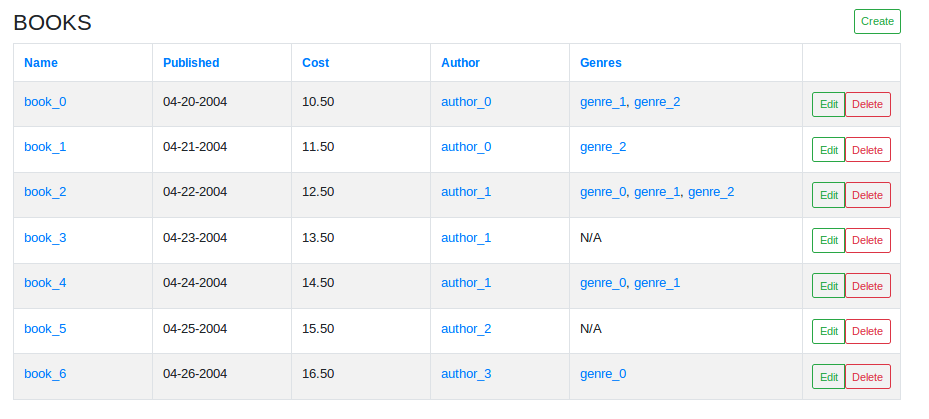
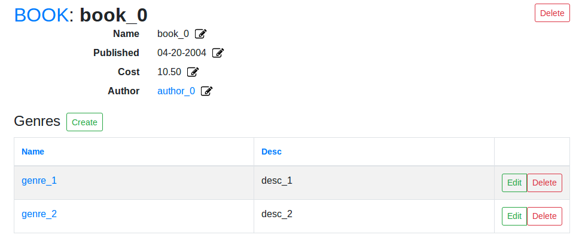
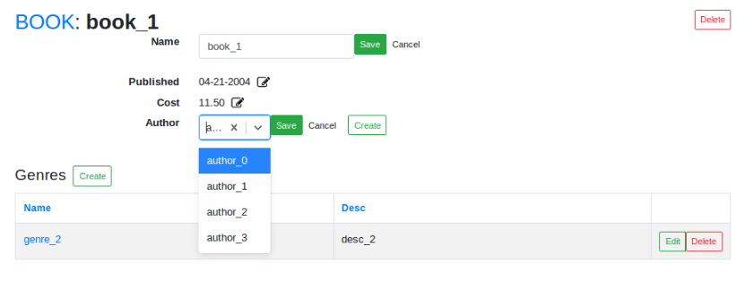
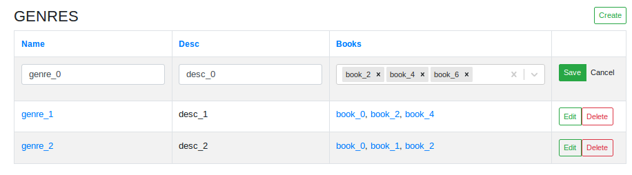
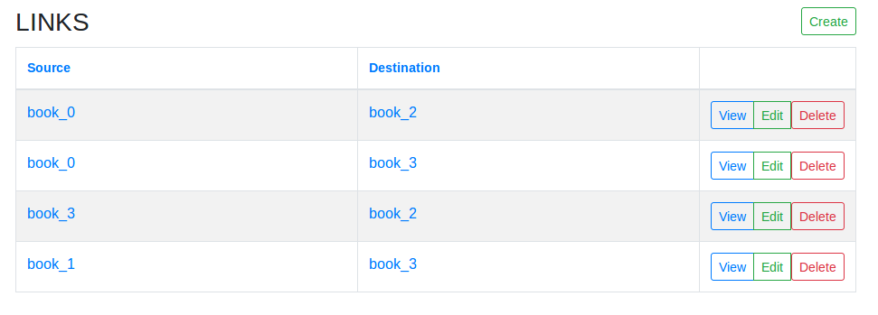
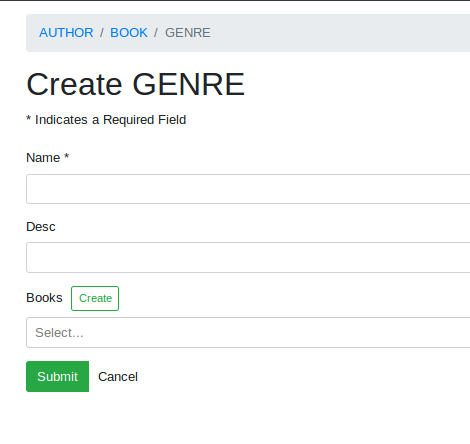
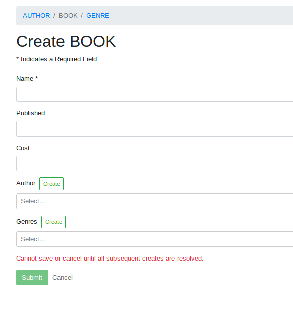
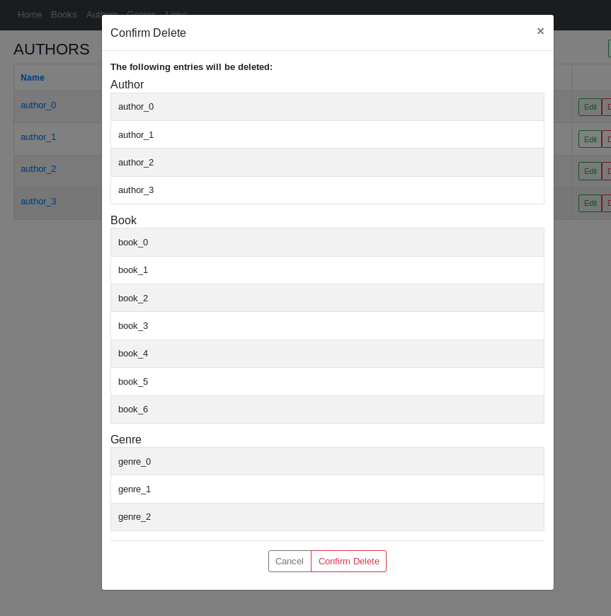

.. _feature_gallery:

*********************
Feature Gallery
*********************

Index Table
------------

List of related objects (Books). Columns (name, published, ect) can be edited, can select which fields appear on table, can customize label, can display detail page links (see 'Name' column, where links take you to specific Book pages). In addition, other objects (genre, author, ect) have links to their respective detail pages. Supports variety of field types. Can create new rows (Create button at top right). Can Delete rows. Warning modal will popup before each delete.

Detail Page
------------

In depth look at each object on the Index table. Inline fields (string, int, single relationship, ect) are organized in a description list. Edit Icons (Pen and paper) indicate editability of fields. ManyToMany relationships (Genres) are listed in a relationship table.

Detail Page Edits
-----------------

Inline edits open an Input component. Multiple fields can be edited at the same time. Relationship fields, (Author for example) can be created if a suitable option isn't found in the select dropdown. Or they can be null (select 'x' in the select dropdown)

Each row in a relationship table can be edited inline and entries can be deleted.

*Note*: Deletes apply to the object, not the relationship. Deleting an object in a relationship table will delete it from the database. To delete the relationship, go to that object's detail page and remove the relationship.

In addition to table deletes, you can delete the entire object you are currently viewing by clicking the Delete button on the top right corner of the Detail page.

To add entries to the relationship, you can create a new object (Create button next to the table name). This will redirect you to the create stack (more about this later).

.. image:: img/Detail_Table_Edit.png
   :width: 600
   :align: center
   :alt: Index

*Multi Select Fields*

Multi-Select fields add a group of objects as a relationship to a single object. (Many Books are added to a single Genre in table below.) Removing objects from this field does not delete the object, it simply cuts the relationship.

Association Table
------------------

An association table displays an object whose only purpose is to link 2 or more other objects. Often, there will be no name. Therefore, there will be no column from which to navigate to the detail page. Therefore, a 'View' button is added to the left, linking to the association object's detail page. All other blue links here go to other objects' detail pages.

Create Stack
-------------

The Create stack allows you to traverse related objects during the creation process without loosing data. The breadcrumbs at the top of the page ('Author/Book/Genre') are links to their respective create form. To add another form to the stack click the 'create' button next to a relationship field (Books, in this example). To pop a form off the stack, click 'Cancel'. To save a form in the stack, click 'Submit'. This will redirect you to the previous form in the stack. If there are no previous forms, it will redirect you to whatever Detail/Index page you came from.

*Note*: You cannot save an object while in the 'middle' of the form stack (see below). you must be at the top of the stack. However you may edit data in this state:

You can enter the form stack from an Index page or a Detail Page. If it occurs from the latter, the newly created object will have a relationship to the parent object (the detail page you just came from). That field will be autopopulated in the form, automatically creating a relationship to the parent object. To create an object without such a relationship, navigate to the Index page and start from there.

Delete Warning
----------------

Every delete action opens up a Delete Warning modal, which describes all other objects that will be deleted in a cascade, if this item were to be deleted. This introspection is not performed by conveyor, however. Rather it is determined by your database relationships. And the modal component will be populated with whatever model data you provide.

