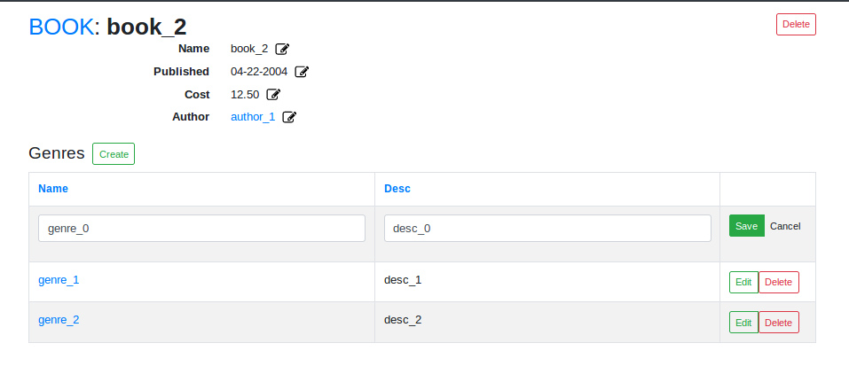

.. _introduction:

*********************
Conveyor Introduction
*********************

Conveyor is a collection of components used for automatic dashboard generation and viewing data with complex relationships. Conveyor was designed as a front end framework for connected Index tables, Detail pages, nested tabs for Detail pages, create stacks (forms connected by related objects which can be traversed), delete buttons, delete warning popups, inline edits, and table edits. There are extensive overrides for components at model and field levels. The framework accommodates different field types including: basic (string, int, float, textarea), relationship (many-to-one, many-to-many, one-to-many), choice type, and special (date, currency, file, ect).

Below is a basic detail page, generated using only model data and a schema, describing each field.

See our
:ref:`Feature Gallery <feature_gallery>` for Index pages, Create Form Stacks, and more.

Conveyor does not manage your data queries/ mutations/ resolvers. But a specific data format is necessary for conveyor. Although conveyor was designed with react-redux, state management is up to you. The actions added to the schema control the edit/create/delete/tooltip 'onSubmit' or 'onChange' in conveyor's components.

============
Limitations
============

Conveyor takes care of setting up the links between objects so the application can be easily traversed. All links are generated with respect to the root url, '/'. For example, a detail page, '/Book/1', cannot be prefixed by anything (cannot be: 'somepath/Book/1'). Conveyor generates links based on modelName and id props:

 .. code-block:: javascript

      <Link
        to={`/${modelName}/${id}`}
        className='btn btn-sm btn-outline-primary'
      >View</Link>

Conveyor was designed for a single react-router. (Meaning the Create/Index/Detail components should not be duplicated and used with multiple react-router links) This is because the format of data required for conveyor can only handle state changes for one instance of a Create/Index/Detail page at a time. There's a conflict when 2 instances of a single page are accessed concurrently.
